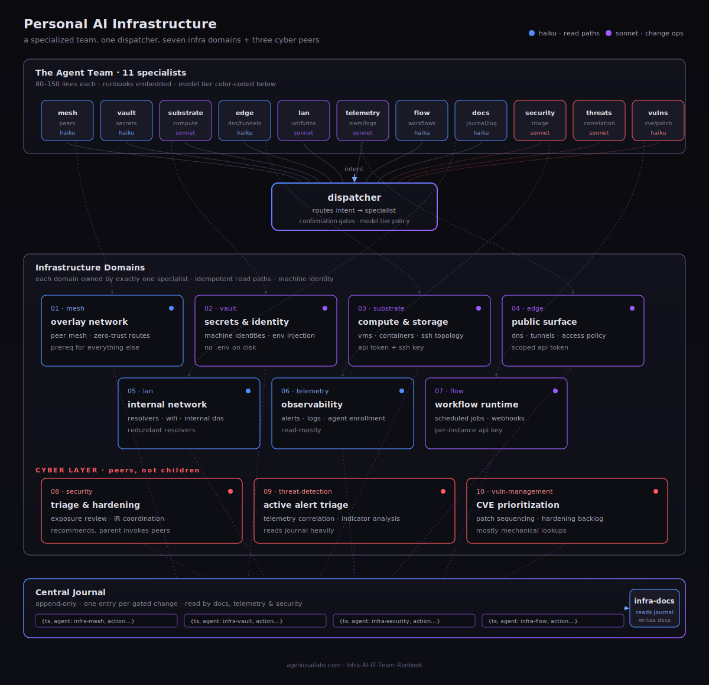
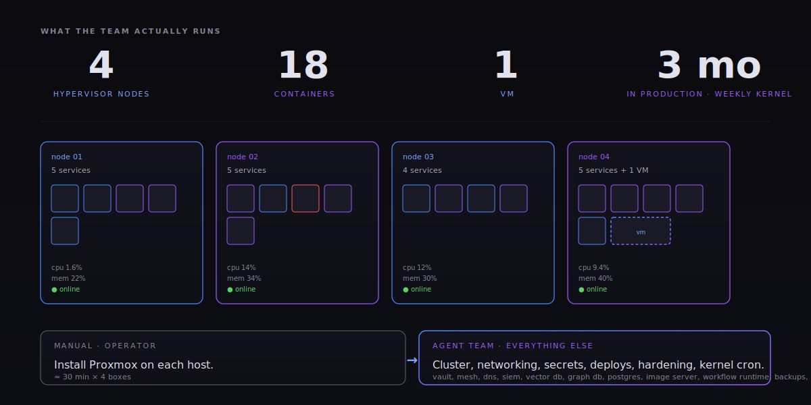

# Infra AI IT Team Runbook

> A specialized AI agent team that runs your self-hosted stack.

Companion repo to the runbook at [ageniusailabs.com/runbooks/personal-ai-infrastructure](https://ageniusailabs.com/runbooks/personal-ai-infrastructure).

## What this is

A practical guide to going from **one Linux box** to **a private AI agent team** that operates the infrastructure you already run: an overlay mesh, a secrets vault, your compute substrate, your public edge, your LAN, your telemetry, and your workflow runtime.

You will end with:

- A private peer-to-peer mesh you control
- Machine-identity secrets, no `.env` on disk
- Idempotent read paths in every domain
- A central, append-only journal that captures every change the team makes
- Eleven specialized agents (eight infra + three cyber peers, plus a routing wrapper), dispatched by intent, that get smarter from your daily use

The architecture, on one page:



## Why split one agent into seven

A monolithic agent loads its full context on every request. A 400-line spec for a DNS lookup wastes tokens, increases latency, and degrades reasoning. Specialists are 80–150 lines each, dispatched by intent. The split is not premature optimization — it is the only way the cost math works once you use the agents daily.

| Tier | Model | Use |
|---|---|---|
| 1 | `claude-haiku-*` | reads, classification, templated calls |
| 2 | `claude-sonnet-*` | planned changes, multi-step coordination |
| 3 | `claude-opus-*` | parent-invoked only, multi-domain incidents |

Default fleet: **7× haiku · 5× sonnet · 0× opus** (opus reserved for incident command).

## How to read this repo

Open in this order:

1. [`sections/00-prerequisites.md`](sections/00-prerequisites.md) — what you need before anything works
2. [`sections/07-the-agent.md`](sections/07-the-agent.md) — the story, before the mechanics
3. Then walk `01` → `06` to build the substrate
4. Then `08` → `10` to split, add memory, and avoid the anti-patterns

Cost-breakdown appendix and example configs live under [`examples/`](examples/).

## Repo map

```
.
├── README.md                    # you are here
├── diagrams/
│   └── topology.svg
├── sections/
│   ├── 00-prerequisites.md
│   ├── 01-the-mesh.md
│   ├── 02-the-vault.md
│   ├── 03-the-substrate.md
│   ├── 04-the-edge.md
│   ├── 05-the-lan.md
│   ├── 06-the-telemetry.md
│   ├── 07-the-agent.md
│   ├── 08-the-split.md
│   ├── 09-the-memory.md
│   ├── 10-the-journal.md
│   └── 11-anti-patterns.md
├── agents/                      # specialist agent specs
│   ├── README.md
│   ├── infra-router.md
│   ├── infra-mesh.md
│   ├── infra-vault.md
│   ├── infra-substrate.md
│   ├── infra-edge.md
│   ├── infra-lan.md
│   ├── infra-telemetry.md
│   ├── infra-flow.md
│   ├── infra-docs.md
│   ├── infra-security.md
│   ├── infra-threat-detection.md
│   └── infra-vuln-management.md
├── policies/                    # cross-cutting rules
│   ├── confirmation-gate.md
│   ├── dispatch.md
│   ├── audit-trail.md
│   └── model-routing-policy.md
└── examples/                    # ready-to-adapt configs
    └── README.md
```

## Stack assumed

The runbook teaches the **patterns**, not vendor-specific secret sauce. The reference stack:

| Domain | Reference tool | Why |
|---|---|---|
| Mesh | NetBird | self-hostable, WireGuard-based, free tier |
| Vault | Infisical | self-hostable, machine-identity native |
| Substrate | Proxmox + SSH | one box runs the whole homelab |
| Edge | Cloudflare | free Tunnels + Access for one user |
| LAN | UniFi + dual Pi-hole | DNS that survives one resolver dying |
| Telemetry | Wazuh | open-source SIEM, single-node viable |
| Workflow | n8n | free, self-hosted, agent-callable |

Swap any of these with your preferred tool — the agent specs use placeholder env vars (`<MESH_FQDN>`, `<EDGE_API_TOKEN>`, etc.), not vendor lock-ins.

## Receipts



Three months in production. Four hypervisor nodes, eighteen containers, one VM. Weekly kernel updates on cron. The only manual step was loading Proxmox onto each host — the agent team handled cluster, networking, secrets, deploys, hardening, and the kernel cron itself.

## Status

In progress. Sections drop incrementally. Subscribe at [ageniusailabs.com/runbooks/personal-ai-infrastructure](https://ageniusailabs.com/runbooks/personal-ai-infrastructure) for an email per section.

## License

[MIT](LICENSE) — use it, fork it, adapt it. If it saves you time, [link back](https://ageniusailabs.com).

## Author

Michael Frostbutter — [ageniusailabs.com](https://ageniusailabs.com) · [LinkedIn](https://www.linkedin.com/in/michael-frostbutter)
