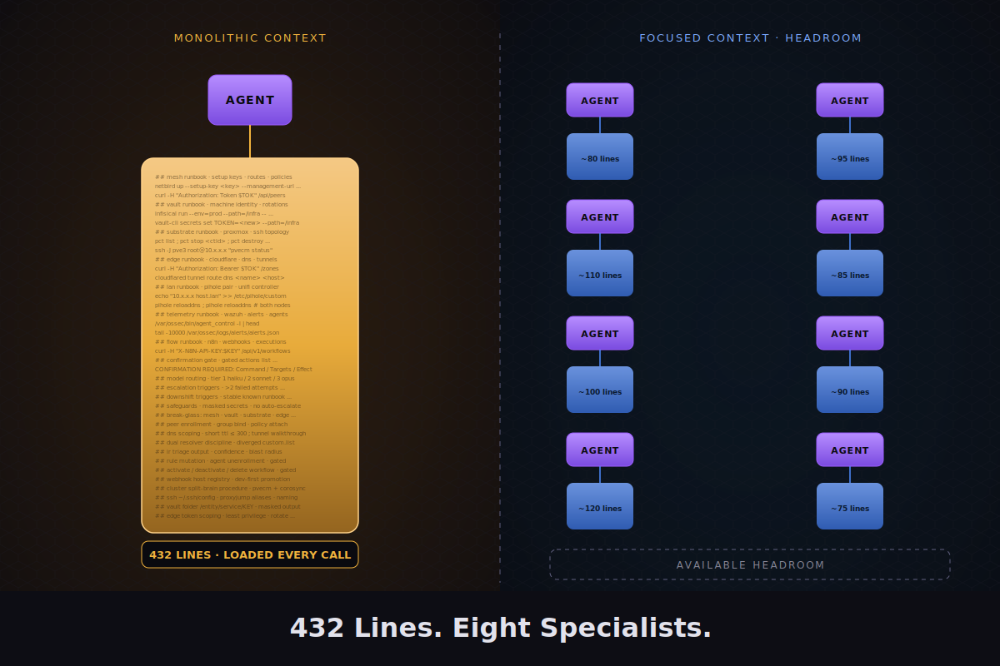

# 07 · The Agent

> Start with the monolith. Run it 30+ days. Then split. **The order matters.**

## Why this section is the heart of the runbook

The split-team architecture in [`/agents`](../agents) is the answer. It is not the starting point.

If you start with eleven specialists, you will:

- Build four of them wrong because you did not yet know what each domain *actually* does for you on a daily basis
- Over-engineer dispatch before you know what gets dispatched
- Optimize cost before you know what costs anything

If you start with one monolithic agent and run it for at least 30 days, you will:

- Discover which domains you actually touch (it will not be all of them, every day)
- Discover which read paths you re-run constantly (those are haiku candidates)
- Discover which change paths actually need confirmation (and which are safe to template)
- Discover which model tier is over- or under-shooting your real requests

**The monolith is not a temporary mistake. It is a measurement instrument.**

## What "the monolith" looks like

A single agent file (Claude Code subagent, OpenAI Assistant, or your harness's equivalent) with:

- One `description` covering all infra ops you can imagine
- One `model` set to the largest tier you are willing to pay for daily (sonnet is a good starting choice)
- Embedded runbooks for every domain (mesh, vault, substrate, edge, LAN, telemetry, flow), inline
- One confirmation gate covering every write path
- One set of tools (Read, Bash, Glob, Grep, WebFetch — that is enough)

It will be 300–500 lines. That is fine. Resist the urge to split it before you have data.

## What 30 days teaches you

By the end of the first month, you will know:

1. **Which domain you query most.** That domain becomes the haiku-default specialist first.
2. **Which domain you write to most.** That domain needs the most-thought-out confirmation gate.
3. **Which questions cross domains.** Those questions reveal where dispatch needs to live.
4. **Where the monolith hurts.** Slow responses, wasted tokens on context you did not need, confused reasoning when two domains' runbooks contradict.

That last one is the trigger. When the monolith starts hurting, [section 8](08-the-split.md) shows you how to split it cleanly.

## Status

Stub. Full section drops next: a complete monolith template, the daily-log pattern that surfaces split signals, and the 30-day review checklist.
