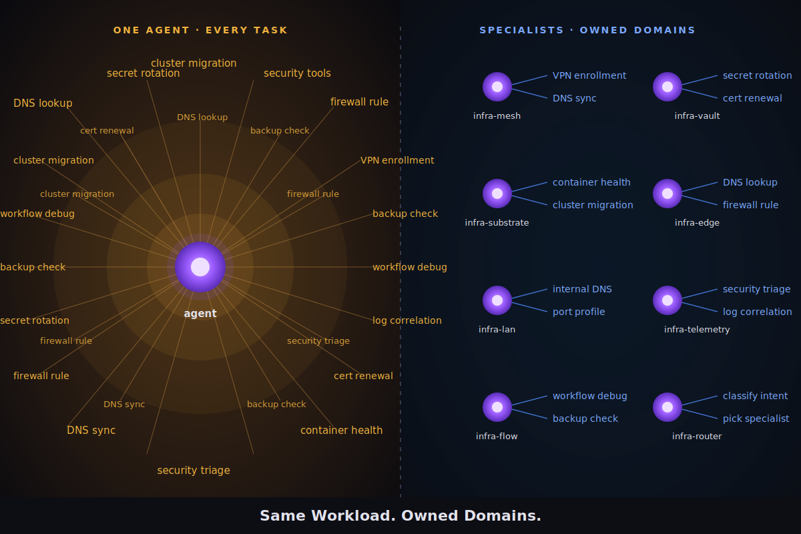

# 08 · The Split

> Domain decomposition, model tiers, confirmation gates, dispatch policy.

## Why split at all

Every request to a monolithic agent loads its full context. A 400-line spec for a DNS lookup wastes tokens, increases latency, and degrades reasoning. Specialists are 80–150 lines each, dispatched by intent. The split is not premature optimization — it is the only way the cost math works once you use the agents daily.

This section walks the actual decomposition: the seven domains, the model-tier defaults, the confirmation gate, and the dispatch rules that make a split team behave like a single coherent operator.

## What this section covers

1. The domain decomposition rule: **one specialist owns end-to-end**
2. Tier defaults: 5× haiku, 3× sonnet, 0× opus (opus is parent-invoked only)
3. Confirmation gates per [`policies/confirmation-gate.md`](../policies/confirmation-gate.md)
4. Dispatch per [`policies/dispatch.md`](../policies/dispatch.md)
5. Migration from monolith → split team without breaking your daily workflow

## Status

Stub. Full section drops next. The agent specs in [`/agents`](../agents) are the production output of this section — read those for the shape.
